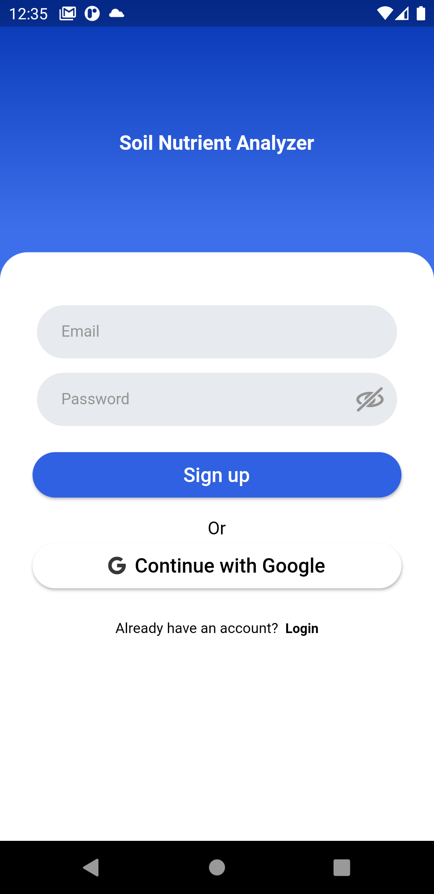
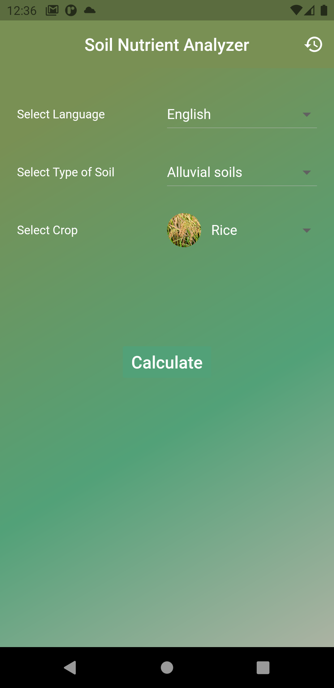
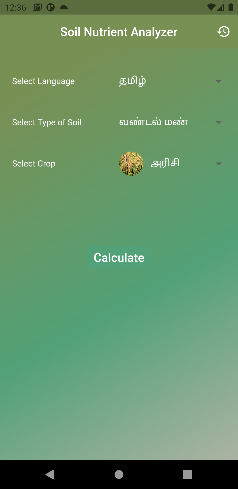
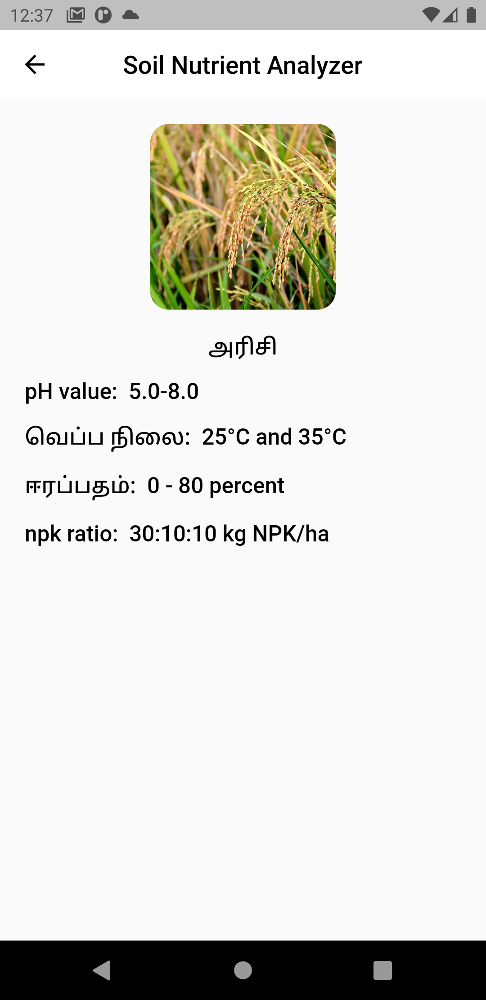
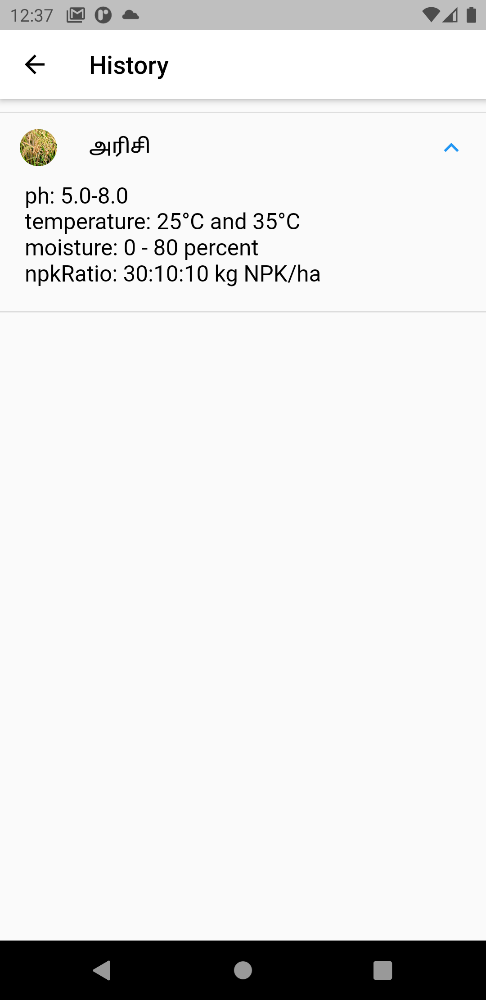

# soilnutrientanalyzer

Soil Nutrient Analyzer is a relatively simple college project that where each user need to be logged in using google login or through mobile number.
By default App is in English, if needed a user can change it to Hindi/Tamil (Regional languages in India) and select their crop name and type of soil and caculate how much nutrients like npk ratio, moisture our soil should have.
We can also view history from the history_icon in the appbar of home.

**This is just a college project, Adopted bloc and has good code architecture and definitely no fancy UI**

### Firebase, Bloc, Hive, UUID are major dependencies for this project.

## Login

## Home(English)

## Home(Tamil)

## Result

## History

